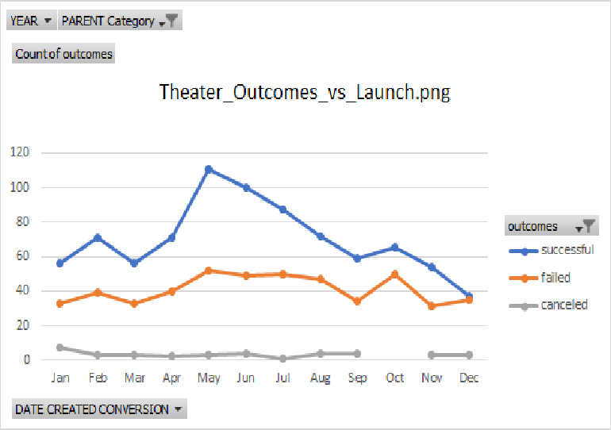
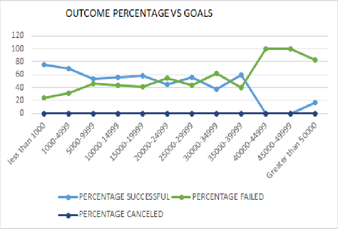

# "An Analysis of Kickstarter Campaigns."
Performing analysis on kickstarter data to uncover trends
# Kickstarting with Excel

## Overview of Project
This project entails how Louise’s play Fever came close to its fundraising goal in a 
short amount of time. Now, she wants to know how different campaigns fared in relation
to their launch dates and their funding goals.

### Purpose
The goal of this project is to visualize campaign outcomes based on their launch dates
and their funding goals.

## Analysis and Challenges

### Analysis of Outcomes Based on Launch Date
This analysis was performed by Creating a pivot chart using fields for rows using the
 date created or launched date  and categorities of outcomes as colomn only for theater 
being a parent category filter.

### Analysis of Outcomes Based on Goals
This analysis was to visualize the percentage of successful, failed, and canceled
 plays based on the funding goal amount.Number of outcomes per category was
 calculated based on finding the count of them in kickstarteranalysis.eg:
formula for finding successful play who have a goal amount less than 1000 is
=COUNTIFS('Kickstarter '!D:D,"<1000",'Kickstarter '!F:F,"successful",'Kickstarter '!R:R,"plays")
Similarly counts for failed and canceled play were found  for each number range.
Percentages of there outcomes were also calculated for each category.
A visual represent via line chart is also used to analyse the percentages of the outcomes 
based on the goal amount from a less than 1000 to above 50000. 

### Challenges and Difficulties Encountered
Initialy had a issue with bring successful outcome first in pivot table analysis 
of theatre outcomes by launch date. But sloved it eventually.
During  analysis of Outcomes based on goals,had challenges implementing the countifs
 formulas. But continue to have a challenge to represent percentage on yaxis
 of the line chart  to replicate excatly what is given in the Module 1 challenge page

## Results

- What are two conclusions you can draw about the Outcomes based on Launch Date?
The Plays launched during the Month of may were the most successful
And There were highest number of failures when plays were launched during  october.
So its not a good idea to launch plays in october and a good choice to launch plays in 
the month of may!

- What can you conclude about the Outcomes based on Goals?
The plays have been successful when the goal amout starts from 76% rather than 24%
and has been steady approximately and succeeded when goal amount was reduced drastically 
from 60 to 0% and then increased to 17 % vs sudden increase from 40 to 100%.

- What are some limitations of this dataset?
This data set still needs to give more information to understand more precisly 
when should a theater be launched for and its goal amout for their subcategories as,
both analysis made , still show vague information as outcomes by launch date seem to over
lap in the line chart , where succesful and failed month overlap in some cases.
as for outcomes based on goals don not give give a clear picture of a certain
 percentage which can be outcomes being successful by a investing in a precises goal amount
as successful and failure outcomes do overlap.

- What are some other possible tables and/or graphs that we could create?
we can create  more line charts and bar graph for each parent category to compare goals to outcome and outcomes to 
launch date 
